## Telecom_Churn_prediction.
This project identifies customer churn for Interconnect Telecommunications, addressing a 25% churn rate over four months. Through data cleaning, exploratory analysis, and sklearn-based model training, the gradient boosting model emerged as a standout performer with an average ROC-AUC of 0.858 across 10 Stratified K-folds, effectively handling churn data imbalance. On unseen data, the model scored 0.841, demonstrating both effectiveness and prevention of overfitting. 

## Table of Contents 
- [Project Description](#project-description)
- [Data Processing](#data-processing)
- [Exploratory Data Analysis](#exploratory-data-analysis)
- [Model Training and Testing](#model-training)
- [Model Testing](#model-testing)
- [Conclusions](#conclusions)

## Project Description
interconnect Telecom had more than 25% of their customers stopped their services over a 4 month period. The aim of this project was to create a machine learning pipeline to identify determinants of churn and customers with a high risk of churning. In turn helping to provide insights toward formulating effective solutions. I started by loading and processing the data as data collection had already been handled for me. Preprocessing revealed a few simple yet important issues to fix such as the target column and missing values for some customers. After handling errors I moved on to feature engineering to improve the data quality before spot checking base models and then training and testing the top 3 models. Once the most optimal model is chosen it was then tested on unseen data to ensure the model was not overfitting. 

## Data Processing

Upon receiving and inspecting the data I discovered that there were a few issues that needed to be addressed before moving forward with the creation of features for modeling. The first issue that needed to be addressed. The first issue noticed was 11 missing values from the total charges column. After looking into the row where these values were missing I had discovered that the missing values were due to the customers being with the service less than a month. However, I elected to fill these missing values with the corresponding monthly charge which effectively handled all missing values in the data. The target column had an issue where the column called end date had values for the date the customers ended or the word “No” to signify that they had not left the service. To fix this I simply split the column into two columns. Wherein a new column called churn where the values that signified the customers end date were turned into the word “yes”, and the values of end date that were ‘no’ were replaced with the most current date in the dataframe. After, both the end date and begin date columns were converted into pandas datetime objects. 

## Exploratory Data Analysis

### Churn vs. Current customers 

*Fig.  1-1- churn share*

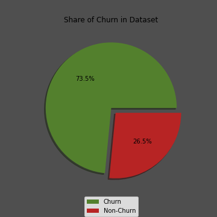

From the data we can see that over the span of 4 months ~ 26.5% of customers have churned. 

 ### Payment Method

 
 *Fig. 1-2 - payment method* 
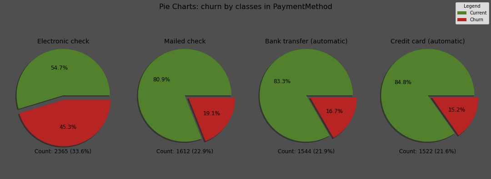

From the two graphs above we can see that the electronic checking method of payment is the most popular of the four options. The issue being that electronic checking has nearly 45.3% of these users churned which is more than double the next highest churn rating below that. 
### Payment Type 

 *Fig. 1-3 - payment type* 
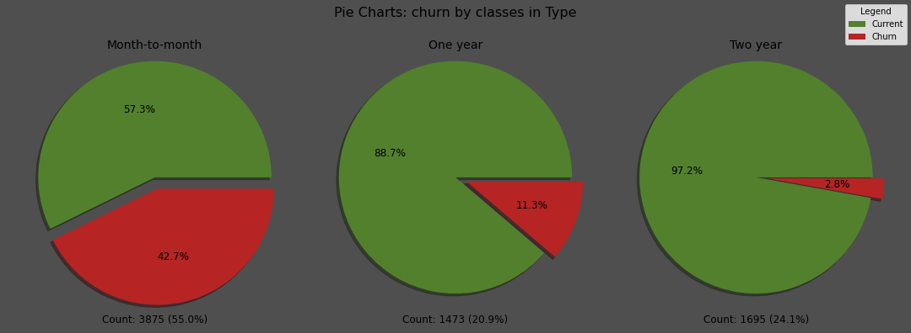

I originally had the idea that it may be beneficial to compare the month-to-month customers as their own group separate from the year and two year contract. After looking at the graph it is safe to assume this would be a potential option for further improvement to the model if the need were to arise. 

### Partners 

*Fig. 1-4 - Partners*
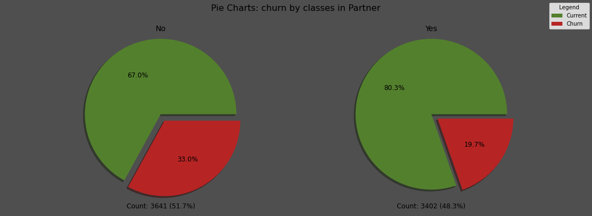

It seems that the group with a higher likelihood of leaving the service is those without a partner. 

### Dependents

*Fig 1-5 - Dependents*
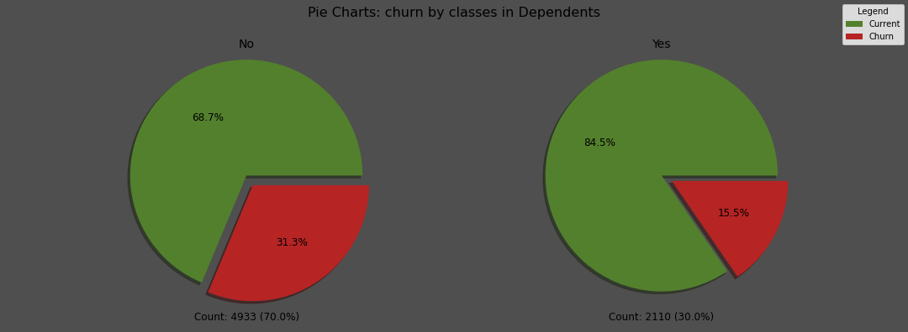

Likewise, from the data on dependents, those with a dependent are twice as likely to churn than those who do not.

### Monthly Cost Distribution

*Fig. 2-1 Monthly Charges*
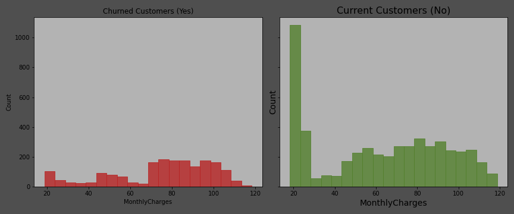

When we compare the monthly costs of the two groups of customers, we can see a clear difference. Churned customers tend to have higher service costs compared to current customers. Most of the churned customers have monthly costs above 50 USD. This suggests that higher costs could be a key factor in why customers decide to leave.

### Tenure Distribution

*Fig. 2-1 Tenure Distribution*
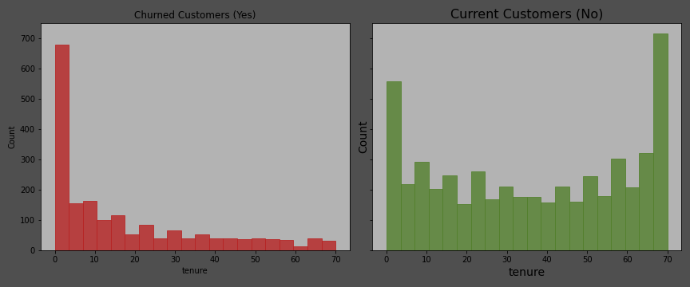

 Upon analyzing the distributions of tenure.  We can confirm a common correlation between loyalty and length of service. In the data we see that nearly forty percent of the customers that will churn do so within six months. 

## Feature engineering

Due to tight time constraints, minimal feature engineering was performed, primarily involving the creation of a "during churn" target column and calculating "tenure" in months from start and end dates.
For feature preprocessing, the target column was manually encoded into integers, and string-based columns were transformed into numerical values using pandas get_dummies. The data was then divided into 60% for training and 40% for testing.
To ensure uniformity, the data was scaled using scikit-learn's StandardScaler, preventing model bias due to varying value ranges. With this cleaned and preprocessed training data, modeling commenced.

## Model Training 

Before training any models, I conducted a rapid evaluation of various models renowned for their performance in tabular churn prediction. For this spot check, I employed stratified k-folds to ensure that the models received training samples that maintained the class imbalance of the target values.
Once the base versions of these models were run, I compared their average ROC-AUC scores and visualized the distribution of scores using a box plot.

*Fig. 3-1 - Model Boxplots*
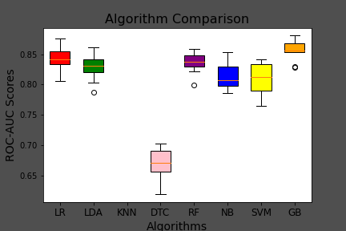

The models for hyperparameter tuning were chosen based on their average AUC-ROC values, and this selection was supported by a box plot illustrating the score distributions across 10 samples of the training set. The top three selected models for further tuning are:
- Linear Regression.
- Random Forest.
- GradientBoostingClassifier.
  
 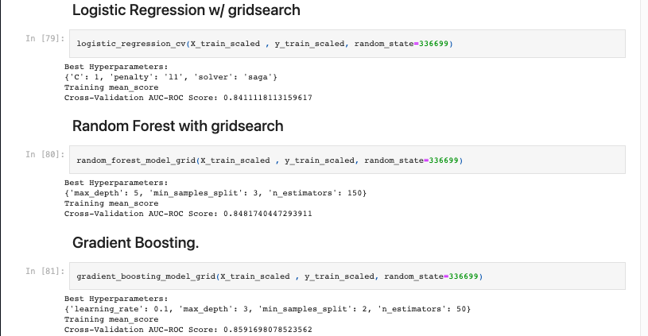

## Model Testing

As we can see from the results below the gradient boosting model performed the best out of the 3 models. However, I would consider further testing to determine the results of this data. 

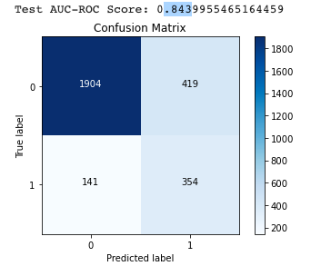 

 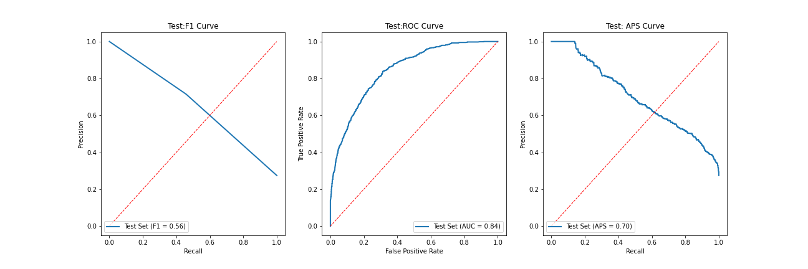

## Conclusions
The GradientBoostingClassifier Model performed the best, achieving a training AUC-ROC score of ~ 0.859 and a testing score of 0.844. 
The drop in testing score could be due to slight overfitting, leaving room for the model to improve further during model selection as well as during feature engineering. 

